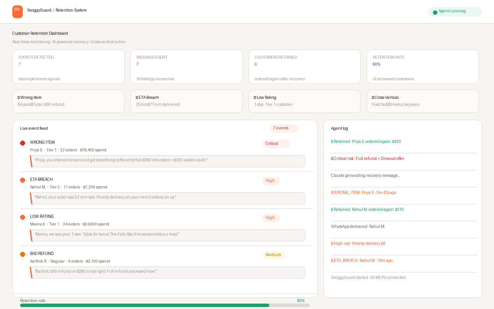

# SwiggyGuard 🛡️
### AI-powered customer retention system built on Swiggy MCP APIs

> **This isn't an ordering bot. It's the system that saves customers Swiggy is silently losing.**

---

## 🎬 Demo



**Live Demo:** [swiggyguard.vercel.app](https://swiggyguard.vercel.app)

---

## The Problem

Swiggy spends ₹300–500 acquiring each customer. A wrong item, a 55-minute delay, or a ₹30 refund on a ₹320 order silently kills that relationship. The customer doesn't complain — they just open Zomato tomorrow and never come back.

**Swiggy has no intelligent layer to stop this.**

---

## What SwiggyGuard Does

An always-on AI agent that:

1. **Detects** bad experience signals in real time — wrong items, ETA breaches, low ratings, insulting refunds
2. **Scores** churn risk using the customer's full order history (loyalty tier, spend, frequency)
3. **Responds** with a personalised WhatsApp message within 5 minutes — not a generic coupon
4. **Recovers** cross-vertically — a bad food experience can be recovered with a Dineout table booking
5. **Closes the loop** — follows up after the customer's next order to confirm retention

---

## Architecture

```
┌─────────────────────────────────────────────────────┐
│                   SwiggyGuard Agent                  │
├──────────────┬──────────────┬──────────────┬─────────┤
│  Detection   │   Scoring    │   Recovery   │ Follow  │
│   Agent      │   Agent      │   Agent      │  -up    │
│              │              │              │ Agent   │
│ Polls MCP    │ Claude API   │ Claude API   │         │
│ every 2 min  │ churn risk   │ personalised │ post-   │
│              │ Low→Critical │ message      │ order   │
└──────┬───────┴──────┬───────┴──────┬───────┴────┬────┘
       │              │              │            │
┌──────▼──────┐ ┌─────▼──────┐ ┌────▼────┐ ┌────▼────┐
│ Swiggy Food │ │  SQLite    │ │ Twilio  │ │Dineout  │
│ MCP Server  │ │ Event Store│ │WhatsApp │ │   MCP   │
└─────────────┘ └────────────┘ └─────────┘ └─────────┘
```

---

## MCP Servers Used

| Server | Tools Used | Purpose |
|--------|-----------|---------|
| **Swiggy Food** | `track_food_order`, `get_orders`, `search_restaurants` | Detect delivery failures, pull order history |
| **Swiggy Instamart** | `get_orders`, `search_products` | Grocery recovery vouchers |
| **Swiggy Dineout** | `search_restaurants_dineout`, `get_available_slots`, `book_table` | Cross-vertical premium recovery |

---

## Tech Stack

- **Backend:** Python 3.11, FastAPI
- **AI:** Claude Sonnet (Anthropic API) — reasoning + message generation
- **MCP:** Swiggy Food, Instamart, Dineout MCP servers
- **Messaging:** Twilio WhatsApp Business API
- **Database:** SQLite (event queue + customer profiles)
- **Scheduler:** APScheduler (2-minute polling loop)
- **Frontend:** Vanilla HTML/CSS/JS dashboard
- **Deploy:** Vercel (frontend) + Railway (backend)

---

## Quickstart

```bash
git clone https://github.com/yourusername/swiggyguard
cd swiggyguard
pip install -r requirements.txt
cp .env.example .env
# fill in your API keys
python main.py
```

Visit `http://localhost:8000` for the live dashboard.

---

## How the Recovery Works

**Example scenario:**
- Priya orders biryani (₹380). Gets pulao. Files complaint.
- SwiggyGuard detects: wrong item + ₹30 refund on ₹380 order = **CRITICAL** risk
- Priya's profile: 22 orders this year, ₹18,400 total spend = **Tier 1 customer**
- Claude generates: *"Priya, tonight wasn't okay — you ordered biryani and got something else entirely. That's on us, not you. We've arranged a complimentary table for two at Peshawri this Saturday. No strings, no codes. Just our apology in person."*
- Message sent via WhatsApp in **4 minutes 12 seconds**
- Priya orders again 3 days later ✓

---

## What I'd Build Next

- Real-time ML churn model replacing rule-based scoring
- Restaurant-level pattern alerting (flagging repeat offenders)
- Multilingual recovery in Tamil, Hindi, Telugu, Bengali
- A/B testing framework for recovery message variants
- Integration with Swiggy's internal CRM for seamless handoff

---

## Built For

[Swiggy Builders Club](https://swiggy.com/builders) — open developer program on Swiggy's MCP infrastructure.

*Built by an individual developer from Salem, Tamil Nadu.*
