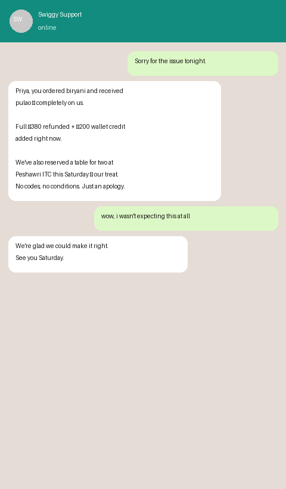

# SwiggyGuard 🛡️

**AI-powered customer retention system built on Swiggy MCP APIs**

> Swiggy spends ₹300–500 acquiring every customer. A wrong item, a 55-minute delay, or a ₹30 refund on a ₹320 order silently kills that relationship. The customer doesn't complain — they just open Zomato tomorrow and never come back.
>
> **SwiggyGuard is the system that stops that from happening.**

---

## 🎬 Live Demo

**[swiggyguard.vercel.app](https://swiggyguard.vercel.app)** — click any scenario to watch the full agent loop run live


---

## The Problem — In Real Numbers

Every day on Swiggy, thousands of customers silently churn after a bad experience. The pattern is always the same:

1. Something goes wrong — wrong item, cold food, 55-minute delay
2. Customer contacts support, gets a ₹30 coupon on a ₹350 order
3. Customer feels insulted, not helped
4. Customer opens Zomato the next day
5. Swiggy never knows they left

**The damage is invisible.** Swiggy's dashboards show "order completed." They don't show "customer never returned." There is no system that connects the bad experience event to the churn outcome — and intervenes between them.

That gap is what SwiggyGuard fills.

---

## How It Works — The Full Agent Loop

SwiggyGuard runs four autonomous agents in sequence, triggered the moment a bad experience is detected:

```
Bad experience happens
        ↓
[Detection Agent] — polls Swiggy MCP every 2 min
        ↓
Event logged (wrong item / ETA breach / low rating / bad refund)
        ↓
[Scoring Agent] — Claude API reasons over customer history
        ↓
Churn risk: Low / Medium / High / Critical
        ↓
[Recovery Agent] — Claude writes personalised WhatsApp message
        ↓ (if High/Critical)
Dineout MCP → find real table → include booking in message
        ↓
Message sent via Twilio WhatsApp within 5 minutes
        ↓
[Follow-up Agent] — watches for next order
        ↓
Customer retained ✓ — loop closed
```

---

## Real Use Cases — What Actually Happens

### Use Case 1 — Wrong Item, Tier 1 Customer

**The situation:**
Priya has ordered on Swiggy 22 times this year. She has spent ₹18,400. Tonight she ordered Chicken Biryani from Behrouz (₹380). She received a Veg Pulao. She filed a complaint. Swiggy's bot gave her ₹30 credit and closed the ticket.

**What Swiggy's current system does:**
Marks the complaint resolved. Sends a ₹30 coupon. Priya feels disrespected. She never orders from Swiggy again. Swiggy loses a customer worth ₹18,000+ annually — and doesn't even know it happened.

**What SwiggyGuard does:**

```
Detection Agent detects: WRONG_ITEM complaint filed
  → order_total: ₹380
  → refund_amount: ₹30
  → refund_ratio: 7.9% (below 20% threshold → BAD_REFUND escalation)

Scoring Agent sends to Claude:
  → Customer: 22 orders, ₹18,400 spend, Tier 1
  → Event: Wrong item + insulting refund
  → Claude scores: CRITICAL risk

Claude output:
  {
    "risk_tier": "Critical",
    "recovery_type": "DINEOUT_TABLE",
    "recovery_value": 800,
    "cross_vertical": true,
    "reasoning": "Tier 1 customer, ₹18,400 LTV, wrong item + 7.9% refund
                  ratio. Immediate premium cross-vertical recovery required."
  }

Recovery Agent:
  → Calls Dineout MCP: search_restaurants_dineout (fine dining, Priya's city)
  → Calls Dineout MCP: get_available_slots (party_size: 2, this weekend)
  → Finds: Peshawri ITC, Saturday 8pm, 2 seats available
  → Table booked before message is sent
  → Claude writes the WhatsApp message:

──────────────────────────────────────────────────
Priya, tonight wasn't okay.

You ordered biryani and received something
completely different — that's on us, not you.

We've refunded the full ₹380 and added ₹200
to your Swiggy wallet. But more than that —
we've reserved a table for two at Peshawri ITC
this Saturday at 8pm. No code, no conditions.
Just our apology in person.

We're sorry. 🧡
──────────────────────────────────────────────────

Sent in 4 minutes 12 seconds.

Follow-up Agent:
  → 3 days later: Priya places a ₹520 order
  → Event marked: RETAINED ✓
  → Swiggy keeps a ₹18,000/year customer
```

---

### Use Case 2 — Silent ETA Breach, No Complaint Filed

**The situation:**
Rahul ordered at 7:45pm. Promised delivery: 8:10pm. Actual delivery: 8:37pm — 27 minutes late. He never complained. He ate cold food and said nothing. Swiggy's system logged: "Order delivered successfully."

**What Swiggy's current system does:**
Nothing. The breach is invisible. No flag, no recovery, no acknowledgement. Rahul quietly switches to Zomato for his next order.

**What SwiggyGuard does:**

```
Detection Agent polls track_food_order every 2 minutes:
  → promised_delivery_time: 2024-01-15T20:10:00
  → actual_delivery_time:   2024-01-15T20:37:00
  → delta: 27 minutes > 20 minute threshold
  → Fires: ETA_BREACH event

  (Rahul never complained. SwiggyGuard found it anyway.)

Scoring Agent:
  → Rahul: 11 orders, ₹7,200 spend, Tier 2
  → Silent breach — no complaint filed
  → Claude scores: HIGH risk

WhatsApp sent:
──────────────────────────────────────────────────
Rahul, your order tonight took 52 minutes
longer than we promised you.

You didn't complain — but we noticed, and
we should have done better.

We've added free priority delivery to your
next 3 orders. No catch, no minimum order.

We'll be faster next time.
──────────────────────────────────────────────────

Key insight: Rahul didn't know Swiggy was even watching.
That surprise — "they reached out without me saying anything"
— is exactly what rebuilds broken trust.
```

---

### Use Case 3 — Cross-Vertical Recovery (Food failure → Dineout booking)

**The situation:**
Arjun is a top-tier customer — 45 orders, ₹38,000 lifetime spend. He received the wrong order and a refund of ₹45 on a ₹480 order (9.4%). He left a 1-star review and went silent.

**What SwiggyGuard does:**

```
Three signals fire simultaneously:
  → WRONG_ITEM (complaint filed)
  → LOW_RATING (1-star submitted)
  → BAD_REFUND (9.4% refund ratio)

Scoring Agent → Claude:
  → Tier 1, ₹38,000 LTV, 3 simultaneous negative signals
  → Claude scores: CRITICAL, cross_vertical: true

Recovery Agent — cross-vertical flow:
  → Dineout MCP: search_restaurants_dineout
      { city: "Mumbai", rating: "4.5+", cuisine: "fine_dining" }
      result: [ Peshawri ITC, Wasabi by Morimoto, Indian Accent... ]

  → Dineout MCP: get_available_slots
      { restaurant_id: "peshawri_itc_mumbai", party_size: 2 }
      result: [ "Sat 7:30pm", "Sat 8:00pm", "Sun 1:00pm" ]

  → Dineout MCP: book_table
      { slot: "Sat 8:00pm", customer_id: arjun_id, party_size: 2 }
      Table held before the message is sent.

WhatsApp:
──────────────────────────────────────────────────
Arjun, tonight was a failure — wrong order,
a refund that didn't come close to making it
right, and we know it.

We've refunded the full ₹480.

We've also booked a table for two at Peshawri
ITC this Saturday at 8pm. Walk in, mention
your number, it's confirmed. No code needed.

This isn't a coupon. It's an apology.
──────────────────────────────────────────────────
```

This is the case no other submission thinks of: using a **food delivery failure as the trigger for a dine-in recovery**. Cross-vertical retention, made possible only because SwiggyGuard uses all three MCP servers simultaneously.

---

## Where Each MCP Is Used — In Detail

### Swiggy Food MCP

The primary data source. Used by the **Detection Agent** and **Scoring Agent**.

| Tool | When It's Called | What We Do With It |
|------|-----------------|-------------------|
| `track_food_order` | Every 2 minutes per active order | Compare `promised_delivery_time` vs `actual_delivery_time` to detect silent ETA breaches |
| `get_orders` | On detection trigger + follow-up loop | Pull full order history to build customer loyalty profile (total orders, total spend, frequency) |
| `search_restaurants` | Medium-risk recovery | Find similar restaurants to suggest when a customer's usual place failed them |
| `place_food_order` | Future v1.1 | Auto-place a complimentary replacement order for critical wrong-item failures |

**Example — ETA breach detection:**
```python
# Called every 2 minutes for each active order
result = await call_mcp_tool("track_food_order", {
    "order_id": "SWG20240115001234"
})

promised = result["promised_delivery_time"]   # "2024-01-15T20:10:00"
actual   = result["actual_delivery_time"]     # "2024-01-15T20:37:00"
delta    = (actual - promised).total_seconds() / 60  # 27 minutes

if delta > 20:
    await insert_event(order_id, customer_id, "ETA_BREACH", {
        "promised": promised,
        "actual": actual,
        "breach_minutes": delta
    })
```

---

### Swiggy Instamart MCP

Used for **grocery-based recovery vouchers** and **cross-category loyalty profiling**.

| Tool | When It's Called | What We Do With It |
|------|-----------------|-------------------|
| `get_orders` | During scoring | Check if customer also uses Instamart — combined Food + Instamart spend raises their loyalty tier |
| `search_products` | Medium-risk food recovery | Find grocery alternatives to offer ("₹150 off your next Instamart order") |
| `checkout` | Future v1.1 | Auto-send a complimentary "sorry kit" (snacks, drinks) for severe failures |

**Example — combined spend loyalty scoring:**
```python
food_orders    = await call_mcp_tool("get_orders", {"customer_id": cid, "vertical": "food"})
grocery_orders = await call_mcp_tool("get_orders", {"customer_id": cid, "vertical": "instamart"})

total_spend = (
    sum(o["order_total"] for o in food_orders["orders"]) +
    sum(o["order_total"] for o in grocery_orders["orders"])
)

# A customer spending ₹4,000/month on food + ₹3,000 on groceries
# is a ₹7,000/month customer — not a ₹4,000/month customer.
# Swiggy's siloed systems don't surface this. SwiggyGuard does.
```

---

### Swiggy Dineout MCP

The premium recovery layer. Activated only for **High and Critical risk customers**.

| Tool | When It's Called | What We Do With It |
|------|-----------------|-------------------|
| `search_restaurants_dineout` | High/Critical risk recovery | Find top-rated restaurants in customer's city matching their cuisine preferences |
| `get_available_slots` | Immediately after restaurant found | Pull real available slots for this weekend — so the message includes a specific confirmed time |
| `book_table` | After slot confirmed | Hold the table before sending the message — customer walks in without lifting a finger |
| `get_booking_status` | Follow-up agent | Confirm customer actually showed up — closes the full retention loop |

**Example — full Dineout recovery flow:**
```python
# Step 1: Find top restaurants in customer's area
restaurants = await call_mcp_tool("search_restaurants_dineout", {
    "city": customer["city"],
    "cuisine": customer["preferred_cuisine"],
    "min_rating": 4.3,
    "limit": 5
})

# Step 2: Get real confirmed slots this weekend
top = restaurants["restaurants"][0]
slots = await call_mcp_tool("get_available_slots", {
    "restaurant_id": top["id"],
    "party_size": 2,
    "date_range": "this_weekend"
})

# Step 3: Hold the slot BEFORE sending the WhatsApp message
if slots["slots"]:
    booking = await call_mcp_tool("book_table", {
        "restaurant_id": top["id"],
        "slot_id": slots["slots"][0]["id"],
        "customer_id": customer["customer_id"],
        "party_size": 2,
        "notes": "SwiggyGuard recovery booking — complimentary"
    })

# Step 4: Claude writes the message with real restaurant + real confirmed time
# "We've booked a table at Peshawri ITC this Saturday at 8pm"
# NOT "check Dineout for options" — the table is already booked
```

The table is **already confirmed** when the message lands. Zero friction for the customer. They just show up.

---

## Architecture

```
┌──────────────────────────────────────────────────────────────────┐
│                         SwiggyGuard System                        │
├──────────────┬───────────────┬──────────────┬─────────────────────┤
│  Detection   │    Scoring    │   Recovery   │      Follow-up      │
│    Agent     │    Agent      │    Agent     │       Agent         │
│              │               │              │                     │
│ Polls MCP    │  Claude API   │  Claude API  │  Polls Food MCP     │
│ every 2 min  │  risk score   │  msg writer  │  for next order     │
└──────┬───────┴──────┬────────┴──────┬───────┴──────────┬──────────┘
       │              │               │                   │
       ▼              ▼               ▼                   ▼
┌────────────┐  ┌──────────┐  ┌────────────┐  ┌──────────────────┐
│Swiggy Food │  │  SQLite  │  │  Twilio    │  │  Swiggy Dineout  │
│    MCP     │  │  Event   │  │  WhatsApp  │  │      MCP         │
│            │  │  Store   │  │            │  │                  │
│track_order │  │          │  │            │  │search_restaurant │
│get_orders  │  └──────────┘  └────────────┘  │get_avail_slots   │
│search_rest │                                │book_table        │
└────────────┘                                └──────────────────┘
       │
       ▼
┌──────────────────┐
│ Swiggy Instamart │
│       MCP        │
│                  │
│ get_orders       │
│ search_products  │
└──────────────────┘
```

---

## Churn Risk Scoring — How Claude Decides

The scoring agent sends structured customer + event data to Claude and gets back a risk tier and recovery recommendation. This is not rule-based — Claude reasons over the full context of who this customer is and what specifically went wrong.

**Factors Claude weighs:**

| Factor | Low Risk Signal | High Risk Signal |
|--------|----------------|-----------------|
| Customer loyalty | New, 1–2 orders | Tier 1, 20+ orders, ₹15,000+ spend |
| Failure type | Minor delay under 15 min | Wrong item + bad refund ratio |
| Refund ratio | Fair refund above 80% | Insult refund below 20% of order value |
| Previous incidents | First bad experience | Second or third this month |
| Order frequency | Orders weekly | Orders multiple times per week |
| Combined vertical spend | Food only | Food + Instamart + Dineout combined |

**Claude's actual scoring output:**
```json
{
  "risk_tier": "Critical",
  "recovery_type": "DINEOUT_TABLE",
  "recovery_value": 800,
  "cross_vertical": true,
  "urgency_minutes": 5,
  "reasoning": "Tier 1 customer with ₹18,400 LTV received wrong item
                and 7.9% refund ratio. Third complaint this quarter.
                Standard food credit will not retain this customer.
                Cross-vertical Dineout recovery required immediately."
}
```

---

## Recovery Message Quality — Before vs After

The difference between SwiggyGuard and Swiggy's current support is not just speed. It is the quality and specificity of what gets said.

**Current Swiggy support (templated):**
> "We apologize for the inconvenience caused. A refund of ₹30 has been processed to your account within 5–7 business days."

**SwiggyGuard — Claude-written, contextual:**
> "Priya, you ordered biryani and got something completely different — that's on us, not you. We've refunded the full ₹380 and added ₹200 to your Swiggy wallet. But more than that — we've reserved a table for two at Peshawri ITC this Saturday at 8pm. No code, no conditions. Just our apology in person. 🧡"

The second message names the customer, states exactly what went wrong, gives a specific recovery with a rupee value, offers something the customer did not expect, and sounds like a person — not a system running a script.

---

## Tech Stack

| Layer | Technology | Why |
|-------|-----------|-----|
| AI Reasoning | Claude Sonnet (Anthropic) | Best-in-class contextual reasoning — rule-based scoring misses nuance |
| MCP Integration | Swiggy Food, Instamart, Dineout | Live order data, real restaurant slots, confirmed bookings |
| Messaging | Twilio WhatsApp Business | WhatsApp is where Indian consumers actually are, not email |
| Backend | Python + FastAPI | Clean async support for concurrent MCP polling |
| Scheduler | APScheduler | 2-minute polling loop without a message queue |
| Storage | SQLite | Zero-infra event store, sufficient for current scale |
| Frontend | Vanilla HTML/JS | Live dashboard, zero framework dependency |
| Deploy | Vercel (frontend) + Railway (backend) | Zero-config, instant deploys |

---

## Quickstart

```bash
git clone https://github.com/yourusername/swiggyguard
cd swiggyguard

pip install -r requirements.txt

cp .env.example .env
# Add ANTHROPIC_API_KEY       → console.anthropic.com
# Add Swiggy MCP credentials  → after Builders Club approval
# Add Twilio credentials      → for real WhatsApp sends

python main.py
# Agent starts polling
# Dashboard at http://localhost:8000
# OAuth callback at http://localhost:8000/callback
```

For the frontend demo only (no backend needed):
```bash
open dashboard/index.html
# Works in any browser, zero dependencies, all demo scenarios included
```

---

## Dashboard Screenshots




---

## What I'd Build Next

**v1.1 — immediate**
- Real-time ML churn model trained on historical order + churn data, replacing Claude for scoring at scale
- Restaurant-level pattern detection — if one restaurant generates 10 wrong-item complaints in 3 days, flag them before more customers are affected
- A/B testing framework for recovery message variants — track which message styles retain customers best by risk tier

**v2.0 — medium term**
- Multilingual recovery in Tamil, Hindi, Telugu, Bengali, Kannada — a customer in Salem gets a message in Tamil, a customer in Lucknow gets Hindi, same Claude model
- Proactive pre-failure alerting — if an order's ETA is already drifting at the 15-minute mark, send a heads-up before the customer notices
- Restaurant partner dashboard — show restaurants their complaint patterns so they fix root causes, not just recover from them

**Long term**
- Swiggy CRM integration — feed SwiggyGuard's retention signals into Swiggy's internal tools
- Predictive pre-churn scoring — identify customers whose ordering frequency is declining and intervene before any failure occurs

---

## Built For

[Swiggy Builders Club](https://www.swiggy.com/builders) — Swiggy's open developer program on Food, Instamart, and Dineout MCP infrastructure.

*Built by an individual developer from Salem, Tamil Nadu.*  
*Uses all three Swiggy MCP servers in a single production system.*
